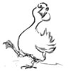

Here's a quick recipe
================

Common to all pages?
---------------------

Try to make the page a standalone document that hits your target age group.

Start with a welcoming hook. Something to gain interest, some questions that need to be resolved -- whatever it takes

Collect the tasks together in some useful order.

Say 'Send us what you've done' in interestingly different ways at regular intervals.

Throw in some ephemera -- anything to keep it light hearted and welcoming.

End with some follow up suggestions, further reading, links. Invitations to submit.

Set up
---------

1. Make a folder for the page in DropBox or Google Drive - let's call it _twinkletoes_.

2. Inside twinkletoes, collect all the assets that are going to live in the page -- images, videos, sounds, artwork, notes -- whatever reference material you need.

3. Edit a narrative for the page in markdown. You might start by using the [online editor](http://stackedit.io) -- you type markdown on the left of the page and it displays the resulting html page on the right. Later on you'll find it convenient to switch to a text editor like `Sublime Text`.

4. You can include any maths in the normal way -- $y = x^2$.

Add images in roughly the right place
-------------------------------------------------

StackEdit or Sublime will create an html page for you. Save this in `twinkletoes`, view it in a browser. Then start inserting images.

It's easy enough to add them with markdown syntax e.g. 

would refer to the file `goose.jpg` in `twinkletoes`, and give it a caption `Here's a demented goose`.

Work up the design with Mike (and any other volunteers)
---------------------------------------------------------------------------

Add in videos, sounds, artwork. Worry about layout, choice of font, colour, background graphics, animations, interactives, different screen widths, etc. etc. 

